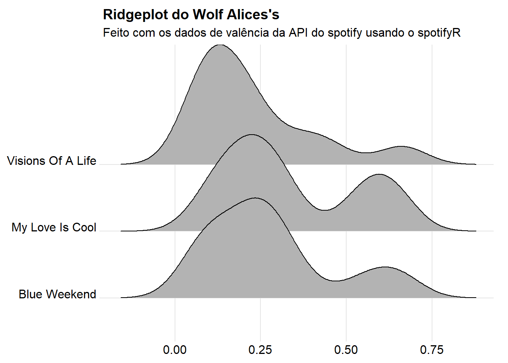
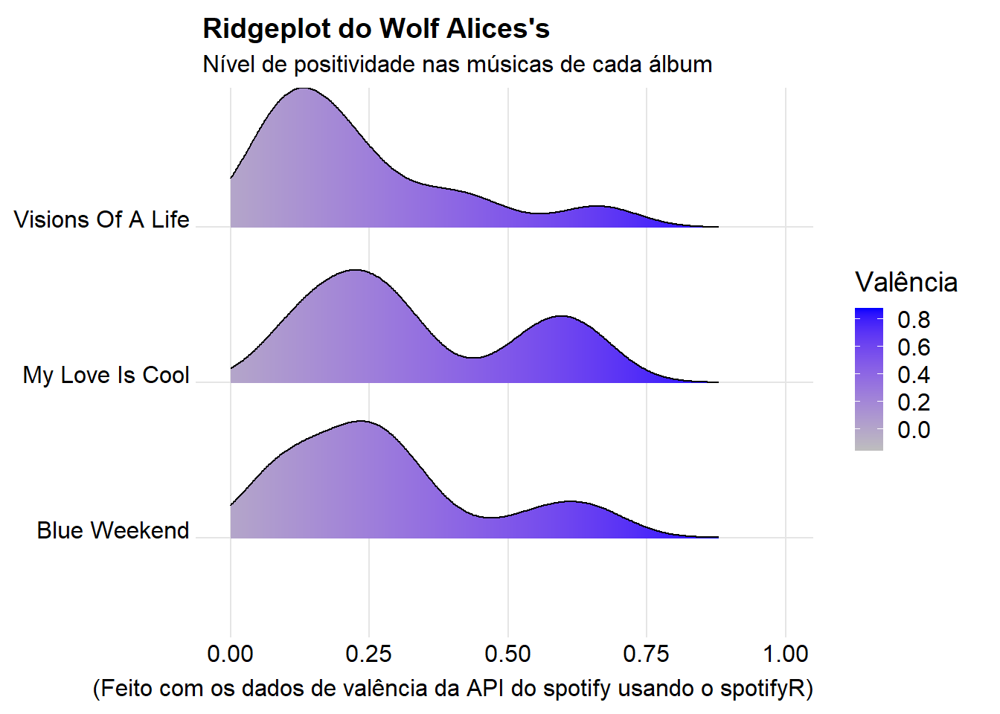
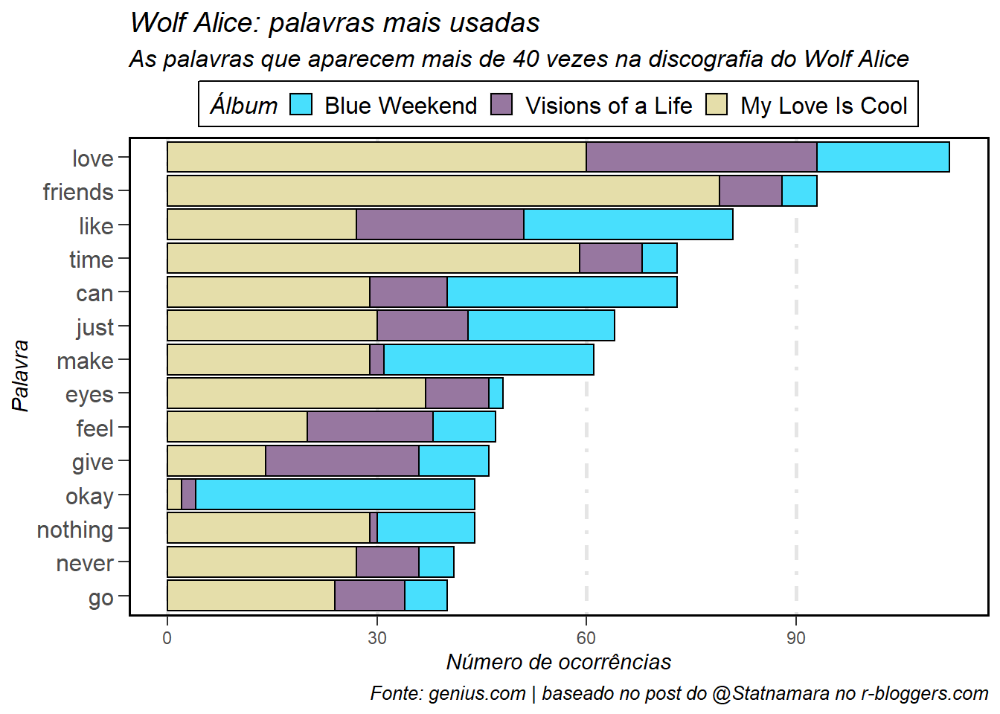
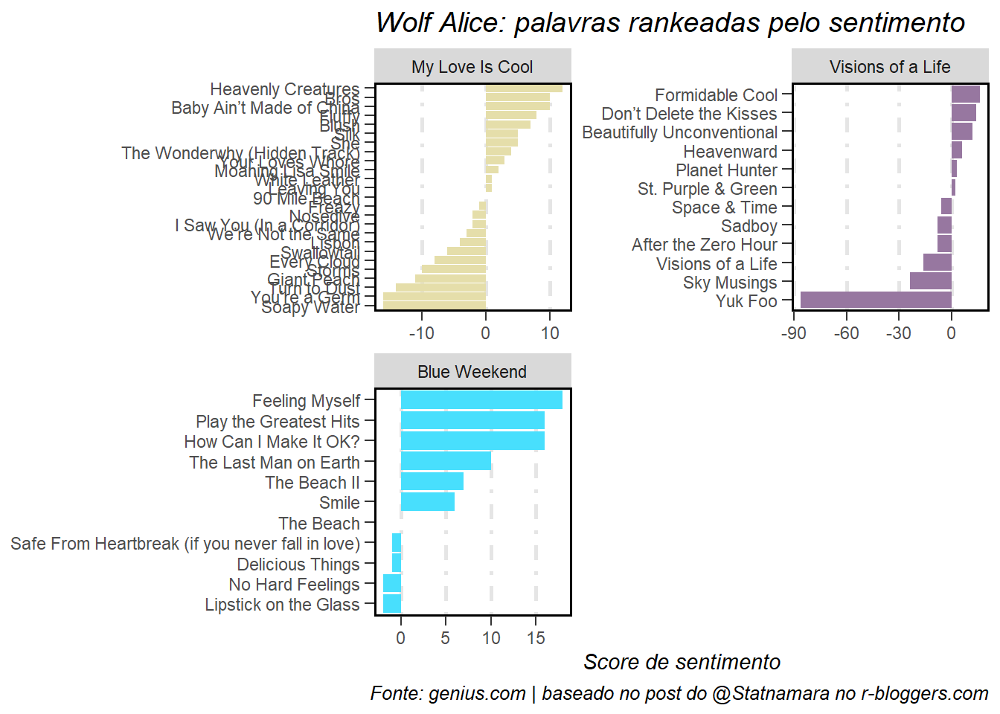

<!-- ## Quick analyses of Wolf Alice's discography using data from Spotify and Genius -->
I created this post inspired by entries from Tom MacNamara aka @Statnamara on [r-bloggers.com](https://www.r-bloggers.com/2021/01/scraping-analysing-and-visualising-lyrics-in-r/), [Simran Vatsa on Medium](https://medium.com/@simranvatsa5/taylor-f656e2a09cc3), [Charlie Thompson on his personal page](https://www.rcharlie.com/blog/fitter-happier/) and the [spotifyR package page (created by RCharlie himself)](https://www.rcharlie.com/spotifyr/). 

I recommend visiting all these pages for a more in-depth view, as well as the documentation and repositories of the developers and packages used. That said, let's proceed.​

<!-- If someone really wants to do something similar (and better), I recommend following the posts referenced instead of mine. I'm not a big expert and I basically copied a bit from each of them (in some cases, I even copied incorrectly! There were things that didn't work). But if by chance you got here, thank you and let's go. -->

### Calling the Initial Packages​

```r
library(tidyverse)
library(spotifyr)
```
Throughout the post, we will call upon several more packages.​

### Spotify API Authentication​
We need to retrieve data from a developer account [at this link](https://developer.spotify.com/my-applications/#!/applications)


Enter the data you generated. Be cautious when sharing your code (you might inadvertently reveal your tokens). An interesting solution for this is the [config package](https://github.com/rstudio/config). With it, you can save your keys in a .yaml file and then retrieve them. This way, you can add the file to the repository's gitignore and hide the keys in the shared code.​
```
Sys.setenv(SPOTIFY_CLIENT_ID = 'xxxxxxxxxxxxxxxxxxxxxxxxxxxxx')
Sys.setenv(SPOTIFY_CLIENT_SECRET = 'xxxxxxxxxxxxxxxxxxxxxxxxxxxx')

access_token <- spotifyr::get_spotify_access_token(
  client_id = Sys.getenv("SPOTIFY_CLIENT_ID"),
  client_secret = Sys.getenv("SPOTIFY_CLIENT_SECRET")
)
```

<!--  ```{r} -->
<!-- access_token <- spotifyr::get_spotify_authorization_code(scope = 'user-read-recently-played') -->

<!--  ``` -->

Now we'll make brief use of the spotifyR package and the Spotify API. The [CRAN page](https://cloud.r-project.org/web/packages/spotifyr/index.html) or the [GitHub repository](https://github.com/charlie86/spotifyr) provide much more information.

### My (actually, your) Most Recently Played Songs​

```r
library(knitr)
library(lubridate)

get_my_recently_played(limit = 5) %>% 
    mutate(artist.name = map_chr(track.artists, function(x) x$name[1]),
           played_at = as_datetime(played_at)) %>% 
    select(track.name, artist.name, track.album.name, played_at) %>% 
    kable()
```


|track.name                                                       |artist.name     |track.album.name         |played_at           |
|:----------------------------------------------------------------|:---------------|:------------------------|:-------------------|
|Requebra                                                         |Vinny           |O bicho vai pegar        |2021-09-09 01:11:49 |
|When A Blind Man Cries - Live                                    |Deep Purple     |Live At Montreux 2011    |2021-09-09 01:03:53 |
|Sex on Fire                                                      |Kings of Leon   |Only By The Night        |2021-09-09 00:55:27 |
|Walking After You                                                |Foo Fighters    |The Colour And The Shape |2021-09-09 00:52:03 |
|Would? - Live at the Majestic Theatre, Brooklyn, NY - April 1996 |Alice In Chains |Unplugged                |2021-09-09 00:46:59 |

### My (again, your) All-Time Favorite Artists

```r
get_my_top_artists_or_tracks(type = 'artists', time_range = 'long_term', limit = 5) %>% 
    select(name, genres) %>% 
    rowwise %>% 
    mutate(genres = paste(genres, collapse = ', ')) %>% 
    ungroup %>% 
    kable()
```


|name            |genres                                                                     |
|:---------------|:--------------------------------------------------------------------------|
|Pearl Jam       |alternative rock, grunge, permanent wave, rock                             |
|Wolf Alice      |art pop, indie pop, indie rock, modern alternative rock, modern rock, rock |
|Alice In Chains |alternative metal, alternative rock, grunge, hard rock, nu metal, rock     |
|Max Richter     |compositional ambient, post-minimalism                                     |
|Nirvana         |grunge, permanent wave, rock                                               |

### My (once more, your) Current Favorite Songs

```r
get_my_top_artists_or_tracks(type = 'tracks', time_range = 'short_term', limit = 5) %>% 
    mutate(artist.name = map_chr(artists, function(x) x$name[1])) %>% 
    select(name, artist.name, album.name) %>% 
    kable()
```


|name                  |artist.name |album.name   |
|:---------------------|:-----------|:------------|
|The Beach             |Wolf Alice  |Blue Weekend |
|Lipstick On The Glass |Wolf Alice  |Blue Weekend |
|Smile                 |Wolf Alice  |Blue Weekend |
|Feeling Myself        |Wolf Alice  |Blue Weekend |
|The Beach II          |Wolf Alice  |Blue Weekend |

### Retrieving Data for Wolf Alice
Simply because they are my favorite band at the moment. Listen to them; they're very good!


```r
wolf_alice <- get_artist_audio_features('wolf alice')
```

#### Taking a Look at What's Available About the Band​

```r
glimpse(wolf_alice)
```

```
## Rows: 144
## Columns: 39
## $ artist_name                  <chr> "Wolf Alice", "Wolf Alice", "Wolf Alice", "Wolf Alice", "Wolf Alice", "Wolf Alice", "Wolf ~
## $ artist_id                    <chr> "3btzEQD6sugImIHPMRgkwV", "3btzEQD6sugImIHPMRgkwV", "3btzEQD6sugImIHPMRgkwV", "3btzEQD6sug~
## $ album_id                     <chr> "1VCTWaze9kuY5IDlbtR5p0", "1VCTWaze9kuY5IDlbtR5p0", "1VCTWaze9kuY5IDlbtR5p0", "1VCTWaze9ku~
## $ album_type                   <chr> "album", "album", "album", "album", "album", "album", "album", "album", "album", "album", ~
## $ album_images                 <list> [<data.frame[3 x 3]>], [<data.frame[3 x 3]>], [<data.frame[3 x 3]>], [<data.frame[3 x 3]>~
## $ album_release_date           <chr> "2021-06-04", "2021-06-04", "2021-06-04", "2021-06-04", "2021-06-04", "2021-06-04", "2021-~
## $ album_release_year           <dbl> 2021, 2021, 2021, 2021, 2021, 2021, 2021, 2021, 2021, 2021, 2021, 2021, 2021, 2021, 2021, ~
## $ album_release_date_precision <chr> "day", "day", "day", "day", "day", "day", "day", "day", "day", "day", "day", "day", "day",~
## $ danceability                 <dbl> 0.704, 0.494, 0.355, 0.515, 0.161, 0.460, 0.318, 0.496, 0.259, 0.666, 0.393, 0.698, 0.467,~
## $ energy                       <dbl> 0.332, 0.498, 0.623, 0.764, 0.426, 0.714, 0.844, 0.376, 0.284, 0.252, 0.539, 0.351, 0.500,~
## $ key                          <int> 8, 2, 7, 11, 3, 0, 0, 2, 7, 2, 1, 8, 2, 7, 4, 3, 0, 0, 2, 7, 2, 1, 8, 2, 7, 11, 3, 0, 0, 2~
## $ loudness                     <dbl> -9.185, -5.739, -6.137, -5.238, -6.095, -5.409, -3.433, -7.469, -8.622, -13.969, -7.164, -~
## $ mode                         <int> 1, 1, 1, 1, 1, 1, 1, 0, 1, 1, 0, 1, 1, 1, 1, 1, 1, 1, 0, 1, 1, 0, 1, 1, 1, 1, 1, 1, 1, 0, ~
## $ speechiness                  <dbl> 0.0348, 0.0351, 0.0360, 0.0444, 0.0312, 0.0445, 0.0615, 0.0300, 0.0332, 0.0425, 0.0327, 0.~
## $ acousticness                 <dbl> 2.57e-01, 1.49e-01, 1.28e-01, 1.52e-04, 8.07e-01, 1.81e-02, 8.29e-06, 2.79e-02, 3.35e-01, ~
## $ instrumentalness             <dbl> 0.493000, 0.061600, 0.059200, 0.878000, 0.000390, 0.003360, 0.831000, 0.233000, 0.112000, ~
## $ liveness                     <dbl> 0.1410, 0.2610, 0.1070, 0.0640, 0.4610, 0.1220, 0.0885, 0.1050, 0.1150, 0.1110, 0.1410, 0.~
## $ valence                      <dbl> 0.2740, 0.2900, 0.1900, 0.3420, 0.2740, 0.2020, 0.5980, 0.0622, 0.0983, 0.6460, 0.0850, 0.~
## $ tempo                        <dbl> 107.982, 121.199, 93.745, 93.579, 181.783, 117.088, 177.105, 115.990, 144.493, 127.451, 10~
## $ track_id                     <chr> "7uELmcXg4U2iCcrXMvD8dj", "0f1bOH82cQvNNZBmmkKv4d", "6tWHb2caC8Kuc5oBO8dHmc", "0wQKKPy050l~
## $ analysis_url                 <chr> "https://api.spotify.com/v1/audio-analysis/7uELmcXg4U2iCcrXMvD8dj", "https://api.spotify.c~
## $ time_signature               <int> 4, 4, 4, 4, 3, 4, 4, 4, 4, 4, 4, 4, 4, 4, 4, 3, 4, 4, 4, 4, 4, 4, 4, 4, 4, 4, 3, 4, 4, 4, ~
## $ artists                      <list> [<data.frame[1 x 6]>], [<data.frame[1 x 6]>], [<data.frame[1 x 6]>], [<data.frame[1 x 6]>~
## $ available_markets            <list> <"CA", "US">, <"CA", "US">, <"CA", "US">, <"CA", "US">, <"CA", "US">, <"CA", "US">, <"CA"~
## $ disc_number                  <int> 1, 1, 1, 1, 1, 1, 1, 1, 1, 1, 1, 1, 1, 1, 1, 1, 1, 1, 1, 1, 1, 1, 1, 1, 1, 1, 1, 1, 1, 1, ~
## $ duration_ms                  <int> 155000, 304280, 247560, 196800, 152333, 287440, 147666, 283586, 261213, 155000, 219653, 15~
## $ explicit                     <lgl> FALSE, FALSE, FALSE, FALSE, FALSE, FALSE, FALSE, FALSE, FALSE, FALSE, FALSE, TRUE, FALSE, ~
## $ track_href                   <chr> "https://api.spotify.com/v1/tracks/7uELmcXg4U2iCcrXMvD8dj", "https://api.spotify.com/v1/tr~
## $ is_local                     <lgl> FALSE, FALSE, FALSE, FALSE, FALSE, FALSE, FALSE, FALSE, FALSE, FALSE, FALSE, FALSE, FALSE,~
## $ track_name                   <chr> "The Beach", "Delicious Things", "Lipstick on the Glass", "Smile", "Safe From Heartbreak (~
## $ track_preview_url            <chr> "https://p.scdn.co/mp3-preview/b0fd6cf0e769948e6248fab87c7365dac886e0bb?cid=a98de2fcd0f945~
## $ track_number                 <int> 1, 2, 3, 4, 5, 6, 7, 8, 9, 10, 11, 1, 2, 3, 4, 5, 6, 7, 8, 9, 10, 11, 1, 2, 3, 4, 5, 6, 7,~
## $ type                         <chr> "track", "track", "track", "track", "track", "track", "track", "track", "track", "track", ~
## $ track_uri                    <chr> "spotify:track:7uELmcXg4U2iCcrXMvD8dj", "spotify:track:0f1bOH82cQvNNZBmmkKv4d", "spotify:t~
## $ external_urls.spotify        <chr> "https://open.spotify.com/track/7uELmcXg4U2iCcrXMvD8dj", "https://open.spotify.com/track/0~
## $ album_name                   <chr> "Blue Weekend", "Blue Weekend", "Blue Weekend", "Blue Weekend", "Blue Weekend", "Blue Week~
## $ key_name                     <chr> "G#", "D", "G", "B", "D#", "C", "C", "D", "G", "D", "C#", "G#", "D", "G", "E", "D#", "C", ~
## $ mode_name                    <chr> "major", "major", "major", "major", "major", "major", "major", "minor", "major", "major", ~
## $ key_mode                     <chr> "G# major", "D major", "G major", "B major", "D# major", "C major", "C major", "D minor", ~
```
#### Let's look only at the albums

```r
wolf_alice %>% 
  distinct(album_name)
```

```
##                         album_name
## 1                     Blue Weekend
## 2                Visions Of A Life
## 3 My Love Is Cool (Deluxe Edition)
## 4                  My Love Is Cool
```

#### Let's remove the 'repeated' ones (or special editions)

```r
wolf_alice <- wolf_alice %>% 
  filter(!album_name %in% "My Love Is Cool (Deluxe Edition)")
```

#### Now we only have the 'original' albums

```r
wolf_alice %>% 
  distinct(album_name)
```

```
##          album_name
## 1      Blue Weekend
## 2 Visions Of A Life
## 3   My Love Is Cool
```

Looking at one of the pieces of information provided by the API, we see that the 'valence' column shows the valence data, which is the level of 'positivity' or 'joy' of a track. The values range from 0 to 1.

#### Level of 'joy'


```r
wolf_alice %>% 
    arrange(-valence) %>% 
    select(track_name, valence) %>% 
    head(5) %>% 
    kable()
```


|track_name                 | valence|
|:--------------------------|-------:|
|Beautifully Unconventional |   0.664|
|Beautifully Unconventional |   0.662|
|Beautifully Unconventional |   0.661|
|No Hard Feelings           |   0.658|
|No Hard Feelings           |   0.653|

First plot:

```r
library(ggjoy)

ggplot(wolf_alice, aes(x = valence, y = album_name)) + 
    geom_joy() + 
    theme_joy() +
    ggtitle("Wolf Alices's joyplot", subtitle = "Made with the valence data from the Spotify API using spotifyR") +
    theme(axis.title = element_blank())
```

<!-- -->
Now a more colorful plot (inspired by the post by [Simran Vatsa on Medium](https://medium.com/@simranvatsa5/taylor-f656e2a09cc3)):

```r
wolf_alice %>% ggplot(aes(x = valence, y = album_name, fill = ..x..)) + 
  geom_density_ridges_gradient(scale = 0.9) + 
  scale_fill_gradient(low = "grey", high = "blue") + 
  theme(panel.background = element_rect(fill = "white")) +
  theme(plot.background = element_rect(fill = "white")) +
  xlim(0,1) +
  theme_joy() +
  theme(axis.title = element_blank()) +
  labs(fill = 'Valência') +
  ggtitle("Wolf Alices's joyplot", subtitle = "Level of positivity in the songs of each album") + 
  labs(caption = "(Made with the valence data from the Spotify API using spotifyR)")
```

<!-- -->
**Okay, but what do these curves really mean or show?**
They show the distribution of songs according to 'positivity'. Looking at each of them, for each of the albums, we notice that there is a larger 'volume' of not-so-positive tracks in all three albums (which is why the highest peak is around the values 0~0.25).


## Now using Genius

Now let's try using the Genius package to access Wolf Alice's lyrics:


#### Loading the package

In this specific case, unlike the package used for Spotify, we don't (for now) need a token. The package already simplifies that for us.

```r
library(genius)
```

Selecting the albums:

```r
wolf_alice_albums <- tribble(
 ~artist, ~album,
 "Wolf Alice", "My Love Is Cool",
 "Wolf Alice", "Visions of a Life",
 "Wolf Alice", "Blue Weekend"
)


wa_all_lyrics <- wolf_alice_albums %>% 
  add_genius(artist, album)
```

```
## Joining, by = c("album_name", "track_n", "track_url")
```

```
## Joining, by = c("artist", "album")
```
Looking at the data. It’s clear that something is missing (a lot – for example, the track number in the album), and this is a problem I couldn’t solve.
It’s related to the time it takes to get a response from the request, which ends up causing segments to disappear and songs to have no lyrics at all (and in different ways each time the code is run).
To solve this, it would be necessary to do some kind of configuration or even modify the function to set that waiting time until data is received and then finally the next request is made. But I don’t know how to do that. (It’s kind of hard to correctly show the missing parts of the lyrics in this post, so just trust me)

```r
tail(wa_all_lyrics)
```

```
## # A tibble: 6 x 6
##   artist     album           track_n  line lyric track_title       
##   <chr>      <chr>             <int> <int> <chr> <chr>             
## 1 Wolf Alice My Love Is Cool       1    NA <NA>  Turn to Dust      
## 2 Wolf Alice My Love Is Cool       3    NA <NA>  Your Loves Whore  
## 3 Wolf Alice My Love Is Cool       4    NA <NA>  Moaning Lisa Smile
## 4 Wolf Alice My Love Is Cool       6    NA <NA>  Lisbon            
## 5 Wolf Alice My Love Is Cool       7    NA <NA>  Silk              
## 6 Wolf Alice My Love Is Cool       8    NA <NA>  Freazy
```

Now we would have all the lyrics from all three albums **except unfortunately, no!** :disappointed_relieved:. You can see the problem described above.


<!-- >Getting lyrics for albums is slightly more involved. It first calls genius_tracklist() which first calls gen_album_url() then using the handy package rvest scrapes the song titles, track numbers, and song lyric urls. Next, the song urls from the output are iterated over and fed to genius_url(). -->

The same thing happens here. Each execution returns different and always incomplete data.

```r
tail(genius_album(artist = 'Wolf Alice', album = 'Blue Weekend', info = 'all'))
```

```
## Joining, by = c("album_name", "track_n", "track_url", "track_title")
```

```
## # A tibble: 6 x 8
##   album_name   track_n artist track_title             line element element_artist lyric
##   <chr>          <int> <chr>  <chr>                  <int> <chr>   <chr>          <chr>
## 1 Blue Weekend       2 <NA>   Delicious Things          NA <NA>    <NA>           <NA> 
## 2 Blue Weekend       3 <NA>   Lipstick on the Glass     NA <NA>    <NA>           <NA> 
## 3 Blue Weekend       6 <NA>   How Can I Make It OK?     NA <NA>    <NA>           <NA> 
## 4 Blue Weekend       7 <NA>   Play the Greatest Hits    NA <NA>    <NA>           <NA> 
## 5 Blue Weekend       9 <NA>   The Last Man on Earth     NA <NA>    <NA>           <NA> 
## 6 Blue Weekend      11 <NA>   The Beach II              NA <NA>    <NA>           <NA>
```

<!-- For better visualization, using the DT package. It can be seen that there are missing elements. -->


Since the genius package doesn’t work (the way I wanted), let’s try another method using the geniusr package.

### Using the Genius API and geniusr


<!-- Get the token on the Genius developer page. -->
<!-- ``` -->
<!-- token <- 'xxxxxxxxxxxxxxxxxxxxxxxxxxxxxxxxxxxxxxxxxxx' -->
<!-- ``` -->

```
Sys.setenv(GENIUS_API_TOKEN = 'xxxxxxxxxxxxxxxxxxxxxxxxxxx')

```
To use [*geniusr*](https://github.com/ewenme/geniusr), we’ll need API authentication from Genius. Get the token from the Genius developer page and paste it. If it doesn’t work immediately, pay attention when running – RStudio might ask for the token in the console. Paste it in the console and continue.


Loading the [*geniusr*](https://github.com/ewenme/geniusr) package and finding the Wolf Alice ID:

```r
library("geniusr")
search_artist("Wolf Alice")
```

```
## # A tibble: 1 x 3
##   artist_id artist_name artist_url                           
##       <int> <chr>       <chr>                                
## 1    326078 Wolf Alice  https://genius.com/artists/Wolf-alice
```

Now we know the band’s ID is '326078'.

```r
songs <- get_artist_songs_df(326078) 

# Getting the IDs of all the band's songs.
ids <- c(as.character(songs$song_id))

# Creating an empty dataframe.
allLyrics <- data.frame()

# Adding the lyrics to the dataframe.
for (id in ids) {
  allLyrics <- rbind(get_lyrics_id(id), allLyrics)
}
# The problem is that this way some lyrics are left out (like in the previous case).
```

Here’s an alternative way of doing the same thing while working around the problem:

```r
while (length(ids) > 0) {
  for (id in ids) {
    tryCatch({
      allLyrics <- rbind(get_lyrics_id(id), allLyrics)
      successful <- unique(allLyrics$song_id)
      ids <- ids[!ids %in% successful]
      # print(paste("done - ", id))
      # print(paste("New length is ", length(ids))) # These screenshots were meant to show each lyric being added.
    }, error = function(e){})
  }
}
```

Now adding the album for each song in the dataframe:

```r
allIds <- data.frame(song_id = unique(allLyrics$song_id))
allIds$album <- ""
```


```r
for (song in allIds$song_id) {
  allIds[match(song,allIds$song_id),2] <- get_song_df(song)[12]
  # print(allIds[match(song,allIds$song_id),]) # Another screenshot just for verification
}

allLyrics <- full_join(allIds, allLyrics)
```

Removing random albums and *NAs*:

```r
albuns_to_remove <- c("Spotify Singles: Holiday", "Demo & Unreleased", "Spotify Singles", "Spotify Sessions",
                         "B-Sides, Demos & Shit", NA, "triple j Like a Version 14", "Ghostbusters (Original Motion Picture Soundtrack)", "NA")

songs_to_remove <- c("Boys - triple j Like A Version") # Genius just added this song out of nowhere
allLyrics <- allLyrics %>% 
  filter(!album %in% albuns_to_remove) %>% 
  filter(!song_name %in% songs_to_remove)
```

Changing the name of 'My Love Is Cool (Deluxe Edition)' to just 'My Love Is Cool':

```r
allLyrics$album[allLyrics$album == "My Love Is Cool (Deluxe Edition)"] <- "My Love Is Cool"
```


Saving a CSV just in case (a backup):

```r
allLyrics %>% write_csv("allLyrics.csv")
```

Looking at the data:

```r
head(allLyrics)
```

```
##   song_id        album                                                                 line section_name section_artist
## 1 6525032 Blue Weekend                                             If the fast life is fast      Verse 1     Wolf Alice
## 2 6525032 Blue Weekend                                              Then why does it creep?      Verse 1     Wolf Alice
## 3 6525032 Blue Weekend                                         Back at The Castle like 2016      Verse 1     Wolf Alice
## 4 6525032 Blue Weekend                                            They don't play any music      Verse 1     Wolf Alice
## 5 6525032 Blue Weekend                                                 Take it back to mine      Verse 1     Wolf Alice
## 6 6525032 Blue Weekend Life seems to move in circles when you take its straight white lines      Verse 1     Wolf Alice
##                song_name artist_name
## 1 Play the Greatest Hits  Wolf Alice
## 2 Play the Greatest Hits  Wolf Alice
## 3 Play the Greatest Hits  Wolf Alice
## 4 Play the Greatest Hits  Wolf Alice
## 5 Play the Greatest Hits  Wolf Alice
## 6 Play the Greatest Hits  Wolf Alice
```
Everything seems fine. It's a good idea to run View(allLyrics) to check how the CSV turned out in RStudio (or open the CSV externally).

<!-- #### Another way, by album -->


### Text Analysis
First, we 'tokenize' the words:

```r
allLyricsTokenised <- allLyrics %>%
  tidytext::unnest_tokens(word, line)
```

Now counting them, we get:

```r
allLyricsTokenised %>%
  count(word, sort = TRUE) %>% 
  head()
```

```
##   word   n
## 1    i 511
## 2  the 491
## 3  you 484
## 4  and 327
## 5   to 300
## 6    a 255
```


But several 'stop words' appeared, which are just connectors or meaningless for analysis. So we need to remove them.

```r
# removing stop words
stop_words <- (stopwords::stopwords("en", source = "snowball")) 
tidyLyrics <- allLyricsTokenised %>%
  filter(!word %in% stop_words)

# and doing the count again
tidyLyrics %>%
  count(word, sort = TRUE) %>% 
  head()
```

```
##      word   n
## 1      ah 130
## 2    love 103
## 3 friends  93
## 4    like  74
## 5    time  71
## 6     can  70
```
In the case of a band/artist/lyrics in Portuguese, it’s possible to remove stop words from our language (check the documentation or type ?stopwords in the console for more info).

In the end, *Love* was the most frequent (the 'ah' doesn’t count, right? We’ll remove that and other specific stop words soon).

Now we’ll count by album and build a visualization:

```r
topFew <- tidyLyrics %>%
  group_by(album, word) %>%
  mutate(n = row_number()) %>%
  ungroup()
```

Cleaning things up a bit more:

```r
# removing extra columns
topFew <- topFew %>% 
  select(album, word, n)

# getting the max for each word for each album
topFew <- topFew %>%
  group_by(album, word) %>%
  summarise(n = max(n))%>%
  ungroup()
```

And now removing more words ('ooh's, 'oh's, and 'ah's) and limiting to those that appear at least 40 times:

```r
topFew <- topFew %>% 
  group_by(word) %>%
  mutate(total = sum(n)) %>%
  filter(total >= 40,
         word != "ooh", word != "oh", word != "ah") %>%
  ungroup()
```

### Visualizing
We'll do a few more preparations before the plot:

```r
# One color for each album (I used a website to get the dominant color from each album cover).
albumCol <- c("#e5deaa",      # My Love Is Cool
              "#9777a0",      # Visions of a Life      
              "#48dffd")      # Blue Weekend
names(albumCol) <- c("My Love Is Cool", "Visions of a Life",
                     "Blue Weekend")

# Using the albums as factors so that they are 'stacked' in the plot.
topFew$album <- factor(topFew$album, levels = c("Blue Weekend",
                                                "Visions of a Life",
                                                "My Love Is Cool"
))
```

Now finally the plot:

```r
wordsPlot <- ggplot(topFew) +
  
  geom_bar(aes(x = reorder(word, total), 
               y = n,
               fill = as.factor(album)),
           colour = "black",
           stat = "identity") +
  
  coord_flip() +
  
  labs(title = "Wolf Alice: most used words",
       subtitle = "The words that appear more than 40 times in Wolf Alice's discography.",
       caption = "Source: genius.com | based on @Statnamara post on r-bloggers.com",
       y = "Occurrences number",
       x = "Words",
       fill = "Album")+
  
  scale_fill_manual(values = albumCol) +
  
  theme(title = element_text(face = "italic", size = 12), 
        
        panel.border = element_rect(colour = "black", fill=NA, size=1),
        panel.background = element_rect(colour = "black", fill = "white"),
        panel.grid.major.x = element_line(colour="grey90",size = 1, linetype = 4),
        
        axis.title = element_text(face = "italic",size = 11, colour = "black"),
        axis.ticks.length = unit(5, units = "pt"),
        
        legend.background = NULL,
        legend.position = "top",
        legend.key.size = unit(12,"pt"),
        legend.box.spacing = unit(5,"pt"),
        legend.text = element_text(size = 12),
        
        axis.text.y = element_text(size = 12))

wordsPlot
```

<!-- -->

```r
# saving the image
ggsave(filename = "wolfalice_chart.png", plot = wordsPlot, width = 30, height = 24, units = "cm",
type = "cairo")
```
Based on the chart, 'My Love Is Cool' has a higher proportion of the most frequently used words in the lyrics — perhaps because it has more songs, or maybe the lyrics are longer (that's something to think about).

Now let’s make a few more preparations for the final plot:

```r
# creating the 'sentimental' dataframe
wolf_alice_sentiments <- tidyLyrics %>%
  inner_join(tidytext::get_sentiments("bing"))%>% 
  count(album, song_name, sentiment) %>%
  spread(sentiment, n, fill = 0) %>%
  mutate(sentiment = positive - negative)

# Using the albums as factors again, as we did in the last plot
wolf_alice_sentiments$album <- factor(wolf_alice_sentiments$album, 
                               levels = c("My Love Is Cool",
                                          "Visions of a Life",
                                          "Blue Weekend"
                               ))


# assigning the plot to a variable (not strictly necessary)
w_a_plot <- ggplot(wolf_alice_sentiments,
                   aes(reorder(song_name, 
                               sentiment), 
                       sentiment, 
                       fill = album)) +
  
  geom_col(show.legend = FALSE) +
  
  facet_wrap(~album, 
             ncol = 2, 
             scales = "free")+
  
  scale_fill_manual(values = albumCol)+
  
  labs(title = "Wolf Alice: words ranked by sentiment",
       caption = "Source: genius.com | basead on @Statnamara post on r-bloggers.com",
       y = "Sentiment score",
       fill = "Album")+
  
  theme(title = element_text(face = "italic", size = 12), 
      
      panel.border = element_rect(colour = "black", fill=NA, size=1),
      panel.background = element_rect(colour = "black", fill = "white"),
      panel.grid.major.x = element_line(colour="grey90",size = 1, linetype = 4),
      
      axis.title.x = element_text(face = "italic",size = 11, colour = "black"),
      axis.title.y = element_blank(),
      axis.ticks.length = unit(5, units = "pt"),
      
      legend.background = NULL,
      legend.position = "top",
      legend.key.size = unit(12,"pt"),
      legend.box.spacing = unit(5,"pt")) +
  
  coord_flip()

w_a_plot # plotting
```

<!-- -->

```r
# saving the image
ggsave(filename = "wolf_alice_sentiment_chart.png", plot = w_a_plot, width = 36, height = 24, units = "cm",
type = "cairo")
```
Based on the chart, it’s possible to get the impression that Blue Weekend is the most emotionally “positive” work. Meanwhile, Visions of a Life appears to be much more “negative,” and the first album, My Love Is Cool, falls somewhere in between.

It’s also worth noting that there are far more refined and robust ways to analyze the “positivity,” “anger,” or even “sadness” present in the music of an album or artist. I don’t quite have the flair or finesse for that, so I’ll leave you with some references that pull off more impressive—and even beautiful—analyses. Check out the [analysis of the sadness level in Radiohead’s music](https://www.rcharlie.com/images/blog/fitter-happier/album_chart.html) - by Charlie Thompson (aka RCharlie) as well as [Sentify](http://www.rcharlie.net/sentify/), which uses [shiny](https://shiny.rstudio.com/), to create an interactive chart that maps an artist’s sound by sentiment (it’s quite reminiscent of a “political compass”).

## References
- Tom MacNamaras aka @Statnamara post on [r-bloggers.com](https://www.r-bloggers.com/2021/01/scraping-analysing-and-visualising-lyrics-in-r/)
- [Simran Vatsas post on Medium](https://medium.com/@simranvatsa5/taylor-f656e2a09cc3)
- [Charlie Thompsons post on his personal blog](https://www.rcharlie.com/blog/fitter-happier/)
- [spotifyR page (created by RCharlie himself)](https://www.rcharlie.com/spotifyr/)
